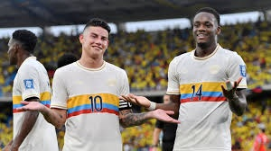
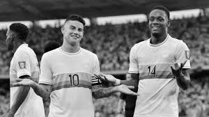
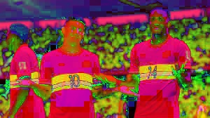
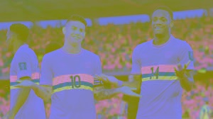
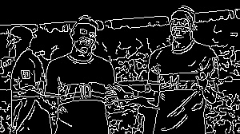
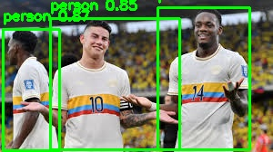

# Procesamiento visual - Parcial practico parte 1

## Descripción General

Este proyecto implementa una solución de procesamiento digital de imágenes utilizando Python, OpenCV y YOLOv8. El programa permite recibir como entrada una imagen o un video previamente almacenado y generar automáticamente diferentes versiones procesadas del contenido. Los filtros aplicados son:

* Imagen original.
* Escala de grises.
* Conversión al espacio de color HSV.
* Conversión al espacio de color LAB.
* Detección de bordes mediante el algoritmo Canny.
* Detección de objetos utilizando YOLOv8.

---

# Dependencias

El proyecto fue desarrollado utilizando Python y las siguientes bibliotecas:

- Python     
- OpenCV      
- NumPy       
- Ultralytics 

Las bibliotecas de OpenCV, Nmpy y Ultralytics se instalaran adelante.

Instalación mediante pip:

```bash
pip install opencv-python numpy ultralytics opencv-contrib-python
```

---

# Instalación

## 1. Clonar el repositorio

```bash
git https://github.com/JorgeAlandete/examen-final-computacion-visual-jorge-alandete.git
cd proyecto-yolo
```

## 2. Crear entorno virtual (opcional)

Linux/Mac:

```bash
python3 -m venv venv
source venv/bin/activate
```

Windows:

```bash
python -m venv venv
venv\Scripts\activate
```

## 3. Instalar dependencias


```bash
pip install opencv-python numpy ultralytics opencv-contrib-python
```

---

# Ejecución

## Procesamiento de una imagen

Colocar la imagen dentro de la carpeta **entrada** del proyecto y modificar la variable INPUT_PATH para que corresponda al nombre y extensión de la imagen de entrada:

```python
INPUT_PATH = "imagen.jpeg"
```

Ejecutar:

```bash
python main.py
```

## Procesamiento de un video

Colocar la el video dentro de la carpeta **entrada** del proyecto y modificar la variable INPUT_PATH para que corresponda al nombre y extensión del video de entrada:

```python
INPUT_PATH = "video.mp4"
```

Ejecutar:

```bash
python main.py
```

Al finalizar, los resultados serán almacenados automáticamente en la carpeta `resultados`.

---

# Estructura del Repositorio

```text
proyecto-yolo/
│
├── src/
│   ├── main.py
│   └── yolov8n.pt
│
├── entrada/
│   ├── imagen.jpg
│   └── video.mp4
│
└── resultados/
    ├── 01_original.*
    ├── 02_grises.*
    ├── 03_hsv.*
    ├── 04_lab.*
    ├── 05_bordes.*
    └── 06_deteccion.*
```

---

# Análisis Técnico

## Conversión a escala de grises

La imagen original en formato BGR es convertida a una representación monocromática utilizando:

```python
cv2.cvtColor(img, cv2.COLOR_BGR2GRAY)
```

Este proceso reduce la información de color y facilita etapas posteriores de análisis.

### Ventajas

* Reduce el costo computacional.
* Facilita la detección de patrones.
* Simplifica algoritmos de visión artificial.

---

## Conversión al espacio HSV

El espacio HSV representa la información visual mediante:

* Hue (tono)
* Saturation (saturación)
* Value (brillo)

Implementación:

```python
cv2.cvtColor(img, cv2.COLOR_BGR2HSV)
```

### Ventajas

* Mayor robustez frente a cambios de iluminación.
* Facilita la segmentación basada en color.

---

## Conversión al espacio LAB

El espacio LAB separa la luminosidad de la información cromática.

Implementación:

```python
cv2.cvtColor(img, cv2.COLOR_BGR2LAB)
```

### Componentes

* L: luminosidad.
* A: verde ↔ rojo.
* B: azul ↔ amarillo.

### Ventajas

* Aproxima mejor la percepción humana del color.
* Muy utilizado en visión por computador y procesamiento avanzado de imágenes.

---

## Detección de Bordes

La detección de bordes utiliza el algoritmo de Canny:

```python
cv2.Canny(gray, 100, 200)
```

### Etapas

1. Suavizado de la imagen.
2. Cálculo de gradientes.
3. Supresión de no máximos.
4. Umbralización por histéresis.

### Resultado

Obtención de los contornos más relevantes presentes en la imagen.

---

## Detección de Objetos con YOLOv8

El sistema emplea el modelo YOLOv8 Nano:

```python
model = YOLO("yolov8n.pt")
```

YOLO (You Only Look Once) es un algoritmo de detección de objetos en tiempo real basado en redes neuronales convolucionales.

### Funcionamiento

1. La imagen es enviada a la red neuronal.
2. El modelo identifica objetos presentes.
3. Se calculan las coordenadas de las cajas delimitadoras.
4. Se asigna una clase y una probabilidad de confianza.
5. Se dibujan las detecciones sobre la imagen.

### Ventajas

* Alta velocidad de inferencia.
* Buena precisión.
* Fácil integración con OpenCV.

---

# ¿Qué problema o propósito aborda el ejercicio?

El ejercicio busca integrar técnicas clásicas de procesamiento digital de imágenes con modelos modernos de inteligencia artificial para analizar contenido visual.

Su propósito principal es comparar diferentes representaciones de una misma imagen o video y demostrar cómo cada transformación resalta características distintas de la información visual.

---

# ¿Qué herramientas, librerías o motores se utilizaron?

- Python
- OpenCV
- NumPy
- YOLOv8
- Ultralytics

---

# ¿Cómo se ejecuta la solución?

1. Instalar las dependencias.
2. Configurar la ruta del archivo de entrada.
3. Ejecutar el script principal.
4. Revisar la carpeta `resultados`.

Comando de ejecución:

```bash
python main.py
```

---

# ¿Qué resultados se obtuvieron?

Debido a la fiebre mundialista actual se eligo la siguiente imagen original y en base a ella se aplicaron los filtros y el modelo.

* Imagen original.



* Imagen en escala de grises.



* Imagen en espacio HSV.



* Imagen en espacio LAB.



* Imagen con bordes detectados.



* Imagen con objetos detectados.




---

# ¿Qué dificultades aparecieron y cómo se resolvieron?

## Compatibilidad entre formatos de imagen y video

### Problema

Las imágenes y los videos requieren procesos de lectura y escritura diferentes.

### Solución

Se implementaron funciones independientes para procesar imágenes y videos.


---

## Alto costo computacional de YOLO

### Problema

La detección de objetos en cada fotograma incrementa significativamente el tiempo de procesamiento.

### Solución

Se utilizó el modelo ligero YOLOv8 Nano (`yolov8n.pt`), optimizado para equipos con recursos limitados.


---

# Conclusiones

El proyecto permitió aplicar conceptos fundamentales de procesamiento digital de imágenes y visión por computador utilizando herramientas modernas de inteligencia artificial.

La combinación de OpenCV y YOLOv8 demuestra cómo es posible realizar tareas avanzadas de análisis visual de manera relativamente sencilla, obteniendo resultados útiles tanto para fines académicos como para aplicaciones reales de automatización, monitoreo y reconocimiento de objetos.
