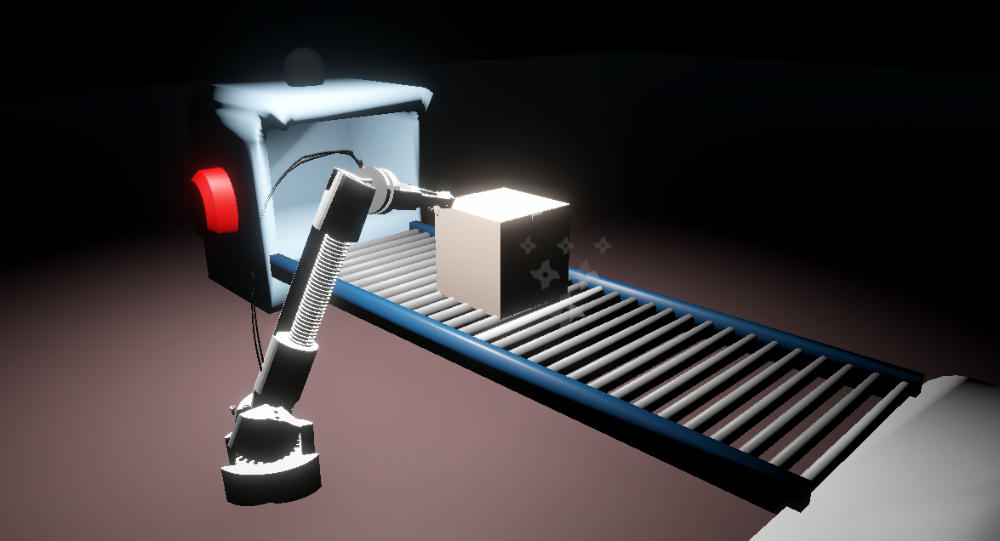
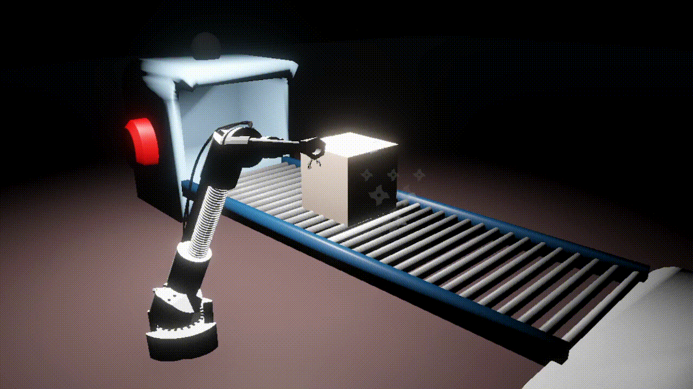
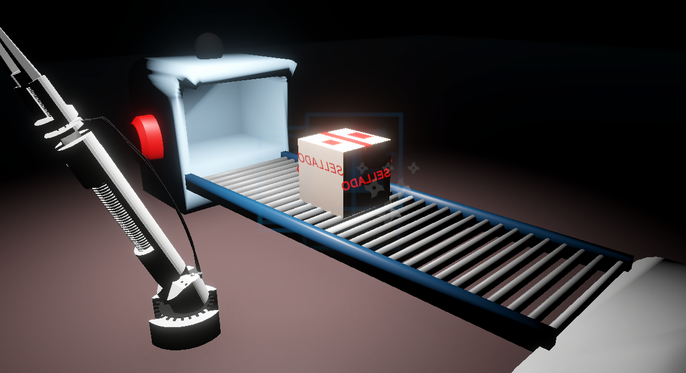
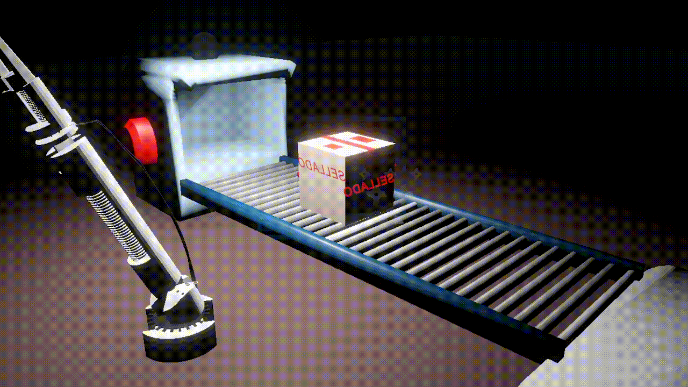
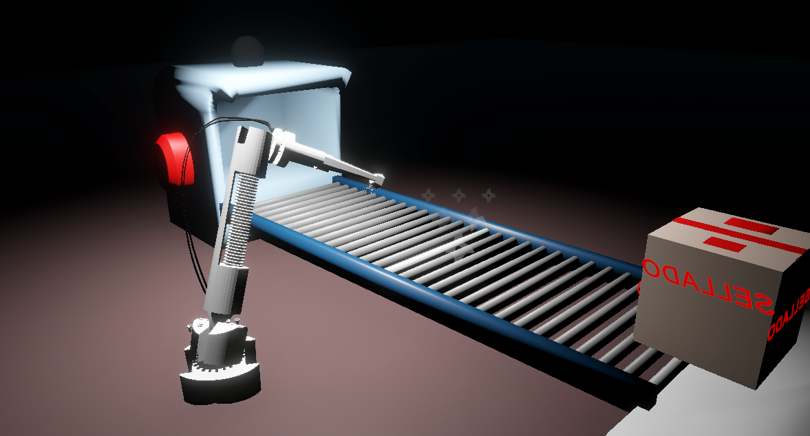
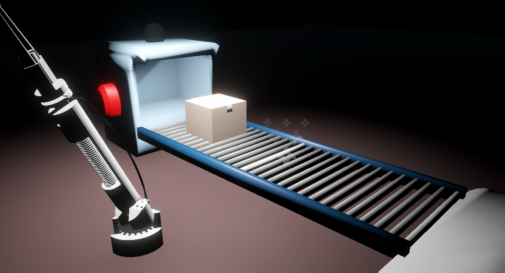

# Escena 3D interactiva - Parcial practico parte 2

## Descripción General

Este proyecto consiste en la simulación de una línea de producción industrial desarrollada en Unity. El jugador controla un brazo robótico articulado encargado de sellar cajas que avanzan sobre una cinta transportadora.

El sistema implementa una linea de producción simple con un brazo robotico donde las cajas son generadas automáticamente, transportadas hasta una estación de trabajo, selladas por el brazo robótico y posteriormente enviadas a un contenedor de almacenamiento.

---

# Problema o Propósito que Aborda el Ejercicio

El ejercicio toma un ambiente de automatización y robotica usando una línea de producción automatizada, permitiendo aplicar conceptos como:

* Manipulación de objetos mediante jerarquías.
* Control de articulaciones mediante transformaciones.
* Interacción mediante teclado y ratón.
* Animación de objetos mediante interpolación.
* Detección de colisiones y raycasts.
* Uso de materiales PBR.

---

# Dependencias

Para ejecutar correctamente el proyecto se requiere:

* Unity Hub.
* Unity 2022 LTS o superior.
* Visual Studio Community 2022 (opcional para edición de scripts).
* Sistema operativo Windows, Linux o macOS compatible con Unity.

---

# Herramientas, Librerías y Motores Utilizados

## Motor de Desarrollo

* Unity Engine

## Lenguaje de Programación

* C#

## Librerías Principales

* UnityEngine
* UnityEngine.UI
* Unity Physics

---

# Instalación

## 1. Clonar el repositorio

```bash
git clone https://github.com/JorgeAlandete/examen-final-computacion-visual-jorge-alandete.git
```

## 2. Abrir Unity Hub

Seleccionar:

```text
Open Project
```

y navegar hasta la carpeta del proyecto.

## 3. Instalar dependencias

Si se utiliza URP:

```text
Window
→ Package Manager
→ Universal RP
```

Instalar la versión recomendada por Unity.

## 4. Abrir la escena principal

```text
Assets/Scenes/FactoryScene.unity
```

---

# Ejecución

Una vez abierto el proyecto:

1. Cargar la escena principal.
2. Presionar el botón **Play** en Unity.
3. Controlar el brazo robótico mediante:

   * **Q**: mover la articulación principal.
   * **E**: mover la articulación secundaria.
   * **Movimiento del mouse**: rotación de la articulación seleccionada.
   * **Click izquierdo**: sellar la caja.
4. Utilizar el botón de la cinta transportadora para avanzar el proceso de producción.
5. Utilizar el botón de cambio de cámara para observar el contenedor de almacenamiento.

---

# Estructura del Repositorio

```text
Unity
│
├── Assets/
│   │
│   ├── Scenes/
│   │   └── FactoryScene.unity
│   │
│   ├── Scripts/
│   │   ├── armMovement.cs
│   │   ├── SealerTool.cs
│   │   ├── ConveyorManager.cs
│   │   ├── ConveyorButton.cs
│   │   └── BoxController.cs
│   │
│   ├── Prefabs/
│   │   ├── Caja_sin_sellar.prefab
│   │   └── Caja_Sellada.prefab
│   │
│   ├── Materials/
│   │   ├── Cardboard.mat
│   │   ├── SealedCardboard.mat
│   │   ├── Metal.mat
│   │   └── Rubber.mat
│   │
│   ├── Models/
│   │   ├── Brazo
│   │   │   └── Brazoarm.fbx
│   │   ├── Caja
│   │   │   ├── box.fbx
│   │   │   └── rojo.mat
│   │   ├── Cinta
│   │   │   ├── belt.fbx
│   │   │   ├── Conveyor.fbx
│   │   │   └── piso.mat
│   │   |
└───└───└── TextMeshPro
README.md
```

---

# Evidencias

Al dar click en el botón de la cinta transportadora esta se mueve trayendo consigo una caja



El movimiento del brazo robotico hecho por el jugador, mediante las teclas "Q" y "E", "Q" moviendo el primer segmento del brazo (el mas cercano a la base) y "E" moviendo el segundo segmento del brazo (el mas extremo del mismo).


Al estar en la posición idónea, donde la punta del brazo apunta hacia la caja, el usuario da click izquierdo para sellarla, lo que provoca, después del sellado que el brazo cambie su posición.





Una vez sellada la caja el usuario de click en el botón de la cinta para llevar la caja sellada al contenedor y traer una nueva jaca sin sellar







Se muestra el proceso general del proyecto planteado, donde el usuario da click en el botón de la cinta, esta avanza, dándole una nueva caja, el usuario mueve el brazo robotico hasta la posición deseada y oprime click para Sellarla, para por ultimo volver a dar click sobre el botón de la cinta y llevar la caja sellada al contenedor.


---

# Análisis Técnico

## Arquitectura General

El proyecto está compuesto por tres sistemas principales:

### Sistema de Manipulación

Controla el movimiento del brazo robótico mediante una jerarquía de transformaciones.

```text
Segment1
└── Segment2
```

La rotación del segmento principal afecta automáticamente al segmento secundario debido a la relación padre-hijo.

---

### Sistema de Producción

Gestiona el flujo completo de las cajas:

```text
Generar Caja
       ↓
Mover a estación
       ↓
Esperar sellado
       ↓
Sellar
       ↓
Mover a contenedor
       ↓
Generar nueva caja
```

Este sistema es administrado por el script:

```text
ConveyorManager.cs
```

---

### Sistema de Sellado

El sellado utiliza un Raycast emitido desde la herramienta ubicada en la punta del brazo.

```text
ToolPoint
   ↓
Raycast
   ↓
Caja
```

Cuando una caja es detectada:

1. Se destruye la caja sin sellar.
2. Se instancia la caja sellada.
3. Se generan partículas rojas.
4. El brazo adopta una nueva posición aleatoria mediante una animación suave.

---

### Sistema de Animación

Para evitar movimientos bruscos se utiliza interpolación mediante:

```csharp
Quaternion.Lerp()
```

Esto permite transiciones suaves tanto para el brazo robótico como para las cajas transportadas.

---

# Resultados Obtenidos

Durante el desarrollo se logró:

* Implementar una línea de producción funcional.
* Simular una cinta transportadora mediante movimiento programado.
* Implementar un brazo robótico articulado controlado por el usuario.
* Aplicar efectos visuales mediante partículas.
* Implementar animaciones suaves para el movimiento de objetos.
* Utilizar materiales PBR para mejorar el realismo visual.
* Crear una escena industrial con iluminación focalizada.

---

# Dificultades Encontradas y Soluciones

## Control de Articulaciones

## Cambio de Estado de las Cajas

### Problema

Era necesario representar visualmente la diferencia entre una caja sellada y una sin sellar.

### Solución

Se utilizaron dos prefabs independientes:

```text
CajaSinSellar
CajaSellada
```

La caja original es reemplazada por la versión sellada al finalizar el proceso.

---

## Movimiento Suave

### Problema

Los cambios instantáneos de posición y rotación generaban una experiencia poco realista.

### Solución

Se implementaron corrutinas junto con:

```csharp
Vector3.MoveTowards()
Quaternion.Lerp()
```

para producir animaciones fluidas.

